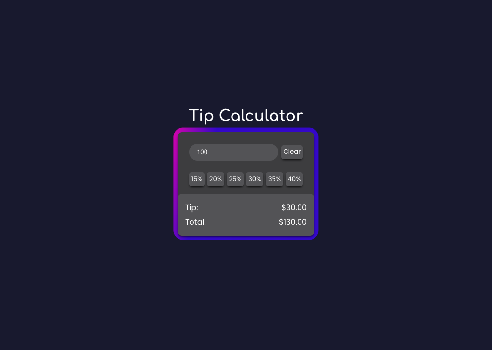

# Tip Calculator

A web application for quickly calculating various tip amounts and the resulting total bill.

🔗 **Live site:** [here](https://jacobrobertsdev.github.io/tip-calculator/)

 
## Built Using
- HTML
- CSS
- Javascript
- VSCode
- Git
- Google fonts

## Author

👤 **Jacob Roberts**

- GitHub: [Jacobrobertsdev](https://github.com/jacobrobertsdev)
